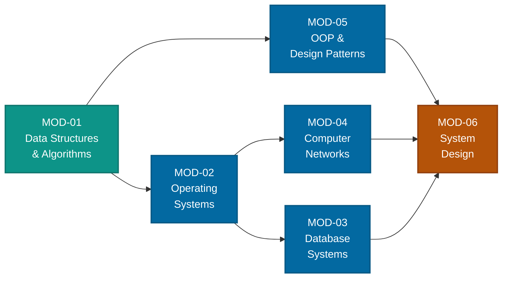

<div align="center">

<picture>
  <source media="(prefers-color-scheme: dark)" srcset="assets/banner-dark.svg">
  <source media="(prefers-color-scheme: light)" srcset="assets/banner-light.svg">
  
</picture>

<picture>
  <source media="(prefers-color-scheme: dark)" srcset="assets/typing-dark.svg">
  <source media="(prefers-color-scheme: light)" srcset="assets/typing-light.svg">
  
</picture>

<picture>
  <source media="(prefers-color-scheme: dark)" srcset="assets/stamps-dark.svg">
  <source media="(prefers-color-scheme: light)" srcset="assets/stamps-light.svg">
  
</picture>

</div>

<picture>
  <source media="(prefers-color-scheme: dark)" srcset="assets/divider-dark.svg">
  <source media="(prefers-color-scheme: light)" srcset="assets/divider-light.svg">
  
</picture>

## ◈ Brief

> A working notebook for computer science fundamentals — the six subjects that
> sit underneath every framework, every language and every interview.
> Notes, diagrams and runnable code, worked out from first principles and
> written down properly rather than half-remembered.

Every diagram in this README is a hand-written SVG living in `assets/`.
No badge services, no image hosts, nothing that can rate-limit or disappear.
It renders the same in five years as it does today.

**Three rules this repo runs on**

| | |
|---|---|
| **Build it to understand it** | If a topic has a data structure, it gets implemented from scratch before any library is touched. |
| **Explain it in one page** | A topic isn't finished until it fits on a single page a stranger could follow. |
| **Show the trade-off** | Every design note states what it gives up, not just what it buys. |

<picture>
  <source media="(prefers-color-scheme: dark)" srcset="assets/divider-dark.svg">
  <source media="(prefers-color-scheme: light)" srcset="assets/divider-light.svg">
  
</picture>

## ◈ Progress schedule

<div align="center">
<picture>
  <source media="(prefers-color-scheme: dark)" srcset="assets/roadmap-dark.svg">
  <source media="(prefers-color-scheme: light)" srcset="assets/roadmap-light.svg">
  
</picture>
</div>

<sub>Numbers live in `tools/gen_readme_assets.py` → `PROGRESS`. Change them, run the script, commit the SVGs.</sub>

<picture>
  <source media="(prefers-color-scheme: dark)" srcset="assets/divider-dark.svg">
  <source media="(prefers-color-scheme: light)" srcset="assets/divider-light.svg">
  
</picture>

## ◈ Learning path

Dependencies first — nothing here is arbitrary. System design is last because
it is only interesting once you know what a cache miss, a page fault and a
`fsync` actually cost.



<picture>
  <source media="(prefers-color-scheme: dark)" srcset="assets/divider-dark.svg">
  <source media="(prefers-color-scheme: light)" srcset="assets/divider-light.svg">
  
</picture>

## ◈ Modules

<sub>`○` not started · `◐` in progress · `●` done</sub>

<details>
<summary><b>MOD-01 · Data Structures &amp; Algorithms</b> &nbsp;—&nbsp; <code>subjects/dsa/</code></summary>

<br/>

| Topic | What to actually understand | Status |
|---|---|:--:|
| Arrays & strings | Cache locality, why `vector` beats `list` far more often than Big-O suggests | ◐ |
| Linked lists | Pointer surgery, dummy heads, cycle detection (Floyd) | ◐ |
| Stacks & queues | Monotonic stack, deque, amortised analysis | ○ |
| Hashing | Open addressing vs chaining, load factor, hash flooding | ○ |
| Trees | BST invariants, traversals, AVL/red-black rotations | ○ |
| Heaps | Sift up/down, heapify in O(n), k-th element problems | ○ |
| Graphs | Adjacency representations, BFS/DFS, Dijkstra, topological sort | ○ |
| Sorting | Quicksort pivots, merge stability, why `std::sort` is introsort | ○ |
| Recursion & backtracking | Recursion tree, pruning, state restoration | ○ |
| Greedy | Exchange argument — proving a greedy choice is safe | ○ |
| Dynamic programming | State design, memo → tabulation, space compression | ○ |
| Tries | Prefix search, memory cost, compressed tries | ○ |
| Segment tree / Fenwick | Range queries, lazy propagation | ○ |
| Disjoint set union | Path compression + union by rank, near-O(1) | ○ |

</details>

<details>
<summary><b>MOD-02 · Operating Systems</b> &nbsp;—&nbsp; <code>subjects/os/</code></summary>

<br/>

| Topic | What to actually understand | Status |
|---|---|:--:|
| Processes & threads | Address space, context switch cost, `fork` vs `clone` | ◐ |
| CPU scheduling | FCFS, SJF, round robin, CFS; turnaround vs response | ◐ |
| Synchronisation | Mutex, semaphore, condition variable, the mutual-exclusion proof | ○ |
| Deadlock | Coffman conditions, banker's algorithm, why prevention usually wins | ○ |
| Memory management | Contiguous allocation, fragmentation, buddy allocator | ○ |
| Virtual memory | Paging, TLB, page-replacement policies, thrashing | ○ |
| File systems | inodes, journalling, `fsync` and what "durable" really means | ○ |
| I/O & disk | Interrupts vs polling, DMA, elevator scheduling, SSD reality | ○ |
| Virtualisation | Hypervisors, containers, namespaces & cgroups | ○ |

</details>

<details>
<summary><b>MOD-03 · Database Systems</b> &nbsp;—&nbsp; <code>subjects/dbms/</code></summary>

<br/>

| Topic | What to actually understand | Status |
|---|---|:--:|
| Relational model | Relations, keys, relational algebra | ◐ |
| SQL | Joins, window functions, `EXPLAIN` output | ◐ |
| Normalisation | 1NF → BCNF, and when denormalising is correct | ○ |
| Indexing | B+ tree layout, covering indexes, hash vs ordered | ○ |
| Transactions | ACID, isolation levels, the anomaly each one permits | ○ |
| Concurrency control | 2PL, MVCC, snapshot isolation, write skew | ○ |
| Recovery | WAL, ARIES, checkpointing | ○ |
| Query optimisation | Cost models, join ordering, cardinality estimation | ○ |
| NoSQL | KV / document / column / graph, and what they trade away | ○ |

</details>

<details>
<summary><b>MOD-04 · Computer Networks</b> &nbsp;—&nbsp; <code>subjects/networks/</code></summary>

<br/>

| Topic | What to actually understand | Status |
|---|---|:--:|
| Layering | OSI vs TCP/IP, encapsulation, where each header goes | ◐ |
| Link layer | Ethernet frames, MAC, ARP, switching | ○ |
| Network layer | IPv4/IPv6, subnetting, NAT, routing tables, BGP sketch | ○ |
| Transport | TCP handshake & teardown, sliding window, UDP's use cases | ○ |
| Congestion control | AIMD, slow start, Reno vs CUBIC vs BBR | ○ |
| DNS | Recursive vs iterative, TTL, records, anycast | ○ |
| HTTP & TLS | 1.1 vs 2 vs 3, keep-alive, handshake, certificates | ○ |
| Sockets | The actual syscall sequence, blocking vs non-blocking, `epoll` | ○ |

</details>

<details>
<summary><b>MOD-05 · OOP &amp; Design Patterns</b> &nbsp;—&nbsp; <code>subjects/oop/</code></summary>

<br/>

| Topic | What to actually understand | Status |
|---|---|:--:|
| Encapsulation & abstraction | Invariants, why public fields leak them | ◐ |
| Inheritance & polymorphism | vtables, dynamic dispatch cost, composition first | ◐ |
| SOLID | Each principle with the bug it prevents | ◐ |
| Creational patterns | Factory, builder, singleton (and its costs) | ○ |
| Structural patterns | Adapter, decorator, facade, proxy | ○ |
| Behavioural patterns | Strategy, observer, state, command | ○ |
| UML | Class & sequence diagrams that are worth drawing | ○ |

</details>

<details open>
<summary><b>MOD-06 · System Design</b> &nbsp;—&nbsp; <code>subjects/systemdesign/</code></summary>

<br/>

| Topic | What to actually understand | Status |
|---|---|:--:|
| Estimation | Back-of-envelope: QPS, storage, bandwidth, latency budgets | ◐ |
| Load balancing | L4 vs L7, health checks, sticky sessions | ◐ |
| Caching | Cache-aside vs write-through, eviction, stampede, invalidation | ◐ |
| Sharding | Range vs hash, hot keys, resharding pain | ○ |
| Replication | Sync vs async, read-your-writes, replica lag | ○ |
| CAP & PACELC | What the theorem says, and what it does **not** say | ○ |
| Async & queues | At-least-once, idempotency, dead-letter queues, backpressure | ○ |
| Rate limiting | Token bucket, leaky bucket, distributed counters | ○ |
| Consistent hashing | Virtual nodes, and why plain modulo breaks on resize | ○ |
| Case studies | URL shortener, news feed, chat, rate limiter, object store | ○ |

</details>

<picture>
  <source media="(prefers-color-scheme: dark)" srcset="assets/divider-dark.svg">
  <source media="(prefers-color-scheme: light)" srcset="assets/divider-light.svg">
  
</picture>

## ◈ Reference architecture

The system the MOD-06 notes keep coming back to. Every box maps to a topic
somewhere above — which is the point.

<div align="center">
<picture>
  <source media="(prefers-color-scheme: dark)" srcset="assets/architecture-dark.svg">
  <source media="(prefers-color-scheme: light)" srcset="assets/architecture-light.svg">
  
</picture>
</div>

| Box | Fails when | Covered in |
|---|---|---|
| Load balancer | Health checks lie and it keeps routing to a dead node | MOD-04 |
| Cache | Key expires under load and every request stampedes the DB | MOD-03 · MOD-06 |
| Message queue | A consumer isn't idempotent and redelivery double-charges | MOD-02 · MOD-06 |
| Primary DB | Writes outgrow one box and sharding was never planned | MOD-03 |
| Read replica | Lag exceeds a user's own write and they see stale data | MOD-03 · MOD-06 |

<picture>
  <source media="(prefers-color-scheme: dark)" srcset="assets/divider-dark.svg">
  <source media="(prefers-color-scheme: light)" srcset="assets/divider-light.svg">
  
</picture>

## ◈ Layout

```
cs-funda/
├── assets/                      # animated blueprint SVGs used by this README
│   ├── banner-{dark,light}.svg
│   ├── typing-{dark,light}.svg
│   ├── stamps-{dark,light}.svg
│   ├── roadmap-{dark,light}.svg
│   ├── architecture-{dark,light}.svg
│   ├── divider-{dark,light}.svg
│   └── footer-{dark,light}.svg
├── tools/
│   └── gen_readme_assets.py     # regenerates every SVG above
├── subjects/
│   ├── systemdesign/            # MOD-06  ← started
│   │   ├── systemdesign.html
│   │   └── signature.cpp
│   ├── dsa/                     # MOD-01  ← planned
│   ├── os/                      # MOD-02  ← planned
│   ├── dbms/                    # MOD-03  ← planned
│   ├── networks/                # MOD-04  ← planned
│   └── oop/                     # MOD-05  ← planned
└── README.md
```

Each subject folder follows the same shape:

```
subjects/<module>/
├── README.md        # the one-page explanation
├── notes/           # topic-by-topic notes
├── code/            # from-scratch implementations
└── diagrams/        # SVG or mermaid sources
```

## ◈ Getting started

```bash
git clone https://github.com/transmogrify-cell/cs-funda.git
cd cs-funda
```

Run a C++ file:

```bash
g++ -std=c++20 -O2 -Wall -Wextra subjects/systemdesign/signature.cpp -o /tmp/run && /tmp/run
```

Regenerate the README visuals after editing progress or wording:

```bash
python3 tools/gen_readme_assets.py     # writes assets/*.svg — stdlib only, no pip install
```

<sub>GitHub caches images aggressively. If an updated SVG looks stale, hard-refresh, or bump the filename.</sub>

## ◈ Contributing

Fixes and better explanations are welcome — especially anywhere a note is
subtly wrong, which is the whole risk of learning in public.

1. Fork and branch: `git checkout -b mod-03/indexing-notes`
2. Keep one topic per commit; `MOD-03: B+ tree fanout and why height stays small`
3. Prefer a worked example over a definition
4. If you change `PROGRESS`, re-run the generator and commit the SVGs with it

## ◈ Resources

| Subject | Source |
|---|---|
| Algorithms | *Introduction to Algorithms* (CLRS) · *Algorithm Design Manual* (Skiena) |
| Operating systems | *Operating Systems: Three Easy Pieces* — free at [ostep.org](https://pages.cs.wisc.edu/~remzi/OSTEP/) |
| Databases | *Database Internals* (Petrov) · CMU 15-445 lectures |
| Networks | *Computer Networking: A Top-Down Approach* (Kurose & Ross) |
| Design patterns | *Head First Design Patterns* · refactoring.guru |
| System design | *Designing Data-Intensive Applications* (Kleppmann) |

## ◈ Licence

MIT — see [`LICENSE`](LICENSE). Notes and diagrams included; use them freely.

<div align="center">

<picture>
  <source media="(prefers-color-scheme: dark)" srcset="assets/footer-dark.svg">
  <source media="(prefers-color-scheme: light)" srcset="assets/footer-light.svg">
  
</picture>

<sub><b>If this is useful, a star keeps the drafting table lit.</b></sub>

</div>
